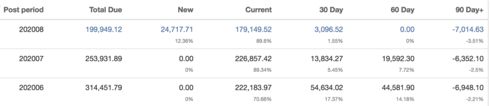

Account aging is a fundamental tool to the collection process.  Often, we spread receivables in 30 day buckets.  This is giving the collector an immediate overview of the current status of the account at a glance.  

It’s even more valuable to add another dimension to your aging and view it over time.  Below is an example of what we at 9ci call “stacked aging”.   It’s a snapshot of the customer’s current position and the last two period closes.

The first line represents where the account is today.  The “new” bucket totals transactions booked in the current period; accordingly it will be non-zero only for this period.  The “current” bucket totals transactions already due or coming due this period.  The “30 day” bucket totals transactions now 30 to 59 days past due, etc.

Looking only at the current status, we feel quite comfortable with the account.  True, it’s carrying an overdue balance, but it’s a small relative to the total, less than 60 days past due and there are more than enough unused credits to offset it.

Looking at the larger picture with historical perspective, there’s more cause for concern.  Significant “60 day” and “30 day” balances were carried at the close of the last two periods.  This delinquency wasn’t allowed to go as far as the “90 day” column, however it also wasn’t just a momentary blip, since it persisted for at least two months.  

We could construct many other scenarios, but the above illustrates the general idea.  Including this extra dimension in your aging adds significantly more information that can still be readily absorbed in a quick glance.