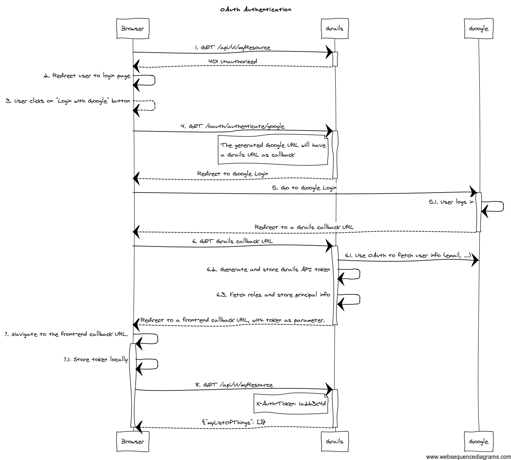

OAuth is an open-standard authorization protocol which lets a service use another service without requiring the security details (username, password, etc.) of the user. **When to use OAuth?** When you need to use a user's private data that is stored on another system. The most common is to use Google, Facebook or Twitter logins on mobile applications.

## Client, Authorization Server and Resource Server

Just to clarify the terms:

- Client or Client Application - The web browser or other application the end user uses
- Authorization Server: The server that processes requests between client and the resource server, generates token and stores with user info (Grails server in the below diagram)
- Resource Server: The protected application, the one that owns identities and credentials. (Google in below diagram)

[Spring Security REST for Grails](https://grails-plugins.github.io/grails-spring-security-rest/latest/docs/index.html#oauth) has one of the best diagrams to illustrate the flow. 

## Authorization Request, callback URL and finally the access token

The client requests access to the service by contacting authorization server. This process is called **Authorization Request**. Authorization server directs the client to the resource server (in the diagram goes to Google Login).
At this point when client logs in successfully you would think is getting a token back and we're all done; not so fast. That would be the basic token authentication; oAuth has to validate communication between client and the server.
Resource server is actually sending back only the **callback URL** to the client, not the token. Authorization server is the one who is generating and storing token, called **access token**. So now authorization server is using callback URL and generated token to fetch user info from the resource server. It stores user info next to the token. Authorization server sends the token back as parameter to the client to be used in future calls. From now, the client can pass in the token as an HTTP header to the authorization server and it's validated there. Resource server is not needed any more.

Couple good references:

- [The Simplest Guide To OAuth 2.0](https://darutk.medium.com/the-simplest-guide-to-oauth-2-0-8c71bd9a15bb)
- [Delegating authentication to OAuth providers - Spring Security REST for Grails](https://grails-plugins.github.io/grails-spring-security-rest/latest/docs/index.html#oauth)
- [OAuth 2.0](https://oauth.net/2/)
- [An Illustrated Guide to OAuth and OpenID Connect](https://developer.okta.com/blog/2019/10/21/illustrated-guide-to-oauth-and-oidc)
